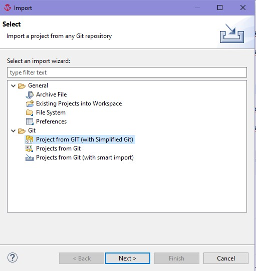
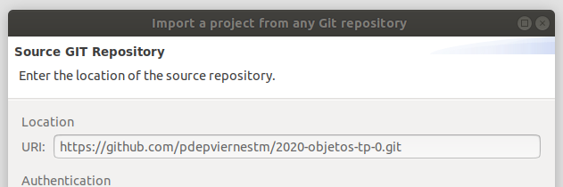
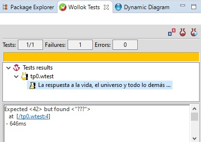
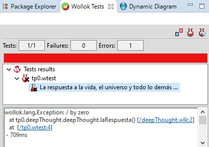
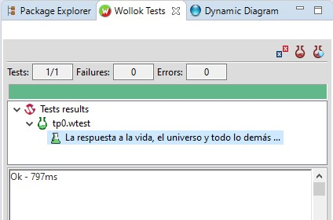
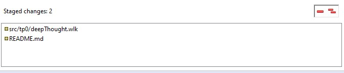

# Consigna TP0

## Objetivos

- Que empieces a conocer algunas de las herramientas que vamos a estar usando durante la cursada, asegurando que te funcionen antes de que que sigamos avanzando con la práctica del paradigma orientado a objetos.
- Seguir usando la ejecución de pruebas automáticas como parte del flujo de trabajo, para asegurar que la solución propuesta cumpla con la funcionalidad esperada.
- Usar un entorno de desarrollo que te ayude a detectar y resolver problemas de forma temprana.
- Usar un repositorio de código donde puedas subir tus cambios todas las veces que quieras, para que tus tutores puedan verlos y dejarte comentarios, así como también mantener un historial de lo que fuiste haciendo, sin miedo a perder tu trabajo.

## Parte 1: Preparar y probar tu entorno

1. Seguí las instrucciones para instalar Wollok que se encuentran en la página oficial: https://www.wollok.org/instalacion/

  > Importante: si ya tenías Wollok instalado, descargá la versión nueva desde la página, que tiene mejoras importantes.
  
2. Importá el proyecto en el entorno de desarrollo usando las opciones:

  - File -> Import...
  - Elegí esta opción para importar un repo usando el plugin Simplified Git y seguí los pasos para clonar tu repo
  
    
    
  - Copiá la dirección para clonar tu repo que se obtiene de GitHub en el campo URI:
  
    

3. Una vez que tengas tu proyecto en el IDE, corré las pruebas como se indica en la sección **Cómo ejecutar la solución** del `README.md` que se encuentra en la raíz del proyecto (vale correr sólo las del TP0 o las de todo el proyecto, al haber sólo un TP el resultado será el mismo).

   Asegurate de que el test del TP0 **falle**, ya que todavía no se implementó lo necesario en el archivo `src/deepThought.wlk` para que pase.

   Debería mostrarse el resultado de haber corrido las pruebas, incluyendo algo como esto:
   
   
   
   al seleccionar un test fallido vas a ver algunos detalles sobre qué fue lo que no funcionó como se esperaba.
   
  > Además si abrís el archivo `src/tp0.wtest` deberías ver un warning de este estilo: `Type system: expected <<String>> but found <<Number>>`.
  > Ese es el sistema de tipos de Wollok, que infiere información de tipos a partir de tu código para ayudarte a detectar potenciales problemas de forma temprana.

4. En el archivo `src/deepThought.wlk` cambiá el string `"???"` que retorna el método `laRespuesta()` por la expresión `1 / 0`, guardá los cambios y volvé a correr los tests.

   Deberías ver que el resultado de las pruebas todavía no es exitoso, en este caso debería mostrarse como un **error** porque se ejecutó una división por cero.
   
   
   
  > En el detalle del error vas a encontrar un **stacktrace** que muestra dónde ocurrió el problema. Si clickeás en los links te va a llevar a la línea correspondiente del archivo donde ocurrió el error.

5. Volvé a cambiar el valor retornado por `laRespuesta()`, esta vez usando el número `42`, guardá y volvé a correr los tests. Confirmá que el test del TP0 ahora sí pasa.

   

## Parte 2: Subir tus cambios a GitHub

Al igual que en los otros trabajos, deberías subir tu solución a GitHub. Podés usar tanto la terminal del sistema operativo (o gitbash) como venías haciendo hasta ahora, o también podés usar un plugin integrado al IDE de Wollok. Para que se muestre usá estas opciones:

   
   
   
   
  > Hay otro plugin similar llamado Git Staging que incluye otras opciones que no consideramos relevantes, y no incluye las opciones de Pull (para integrar los cambios en GitHub que no estén en el repo local) y Push (útil en caso de problemas de conectividad y potenciales conflictos).

1. Luego de seleccionar tu proyecto debería aparecer la lista de archivos modificados. Para agregar todos tus cambios a lo que será tu siguiente commit:

   
   
   Luego de agregarlos, los archivos modificados van a moverse a la lista de abajo (Staged changes), indicando que esos archivos se incluirán en el siguiente commit.
   
   
   
2. Commitear tus cambios con un mensaje representativo y pushearlos al repo remoto:
   
   
   
   > La primera vez que commitees con un autor que no tengas configurado te va a pedir el mail únicamente. Es para una configuración local de git, no es muy relevante.
   >
   > 

Ya sabés que podés subir tu solución tantas veces como quieras. **Es recomendable hacer commits chicos y frecuentes**, en vez de un solo gran commit con todo lo que se pedía resolver.

> En caso de que tengas problemas con el plugin Simplified Git, vale usar el plugin Git Staging junto con otras opciones del IDE que se mencionan en apuntes que están en la página, y también podés usar los comandos de siempre usando gitbash.
